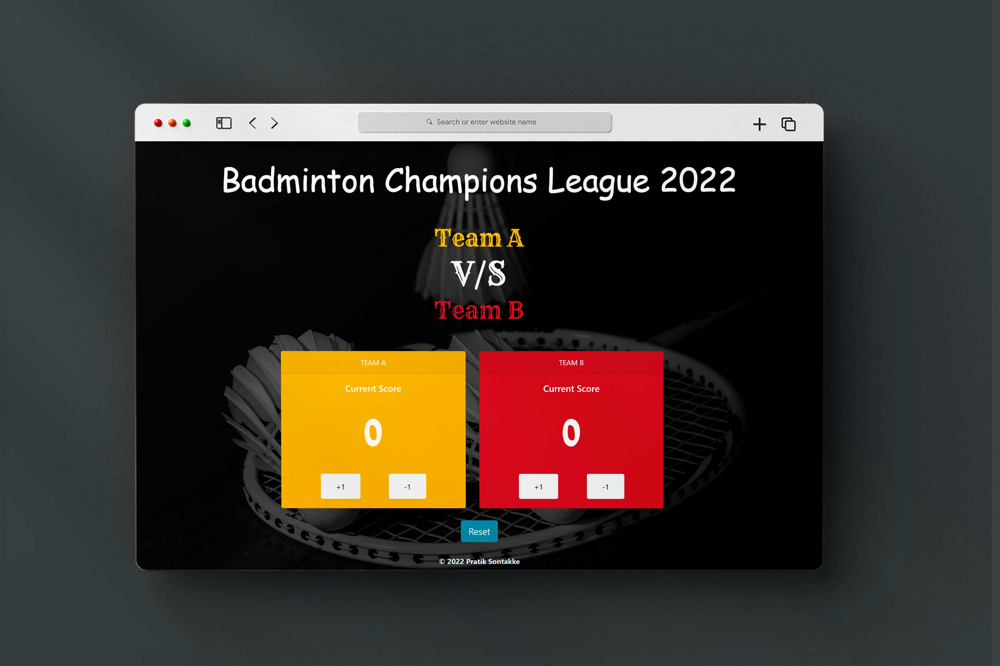
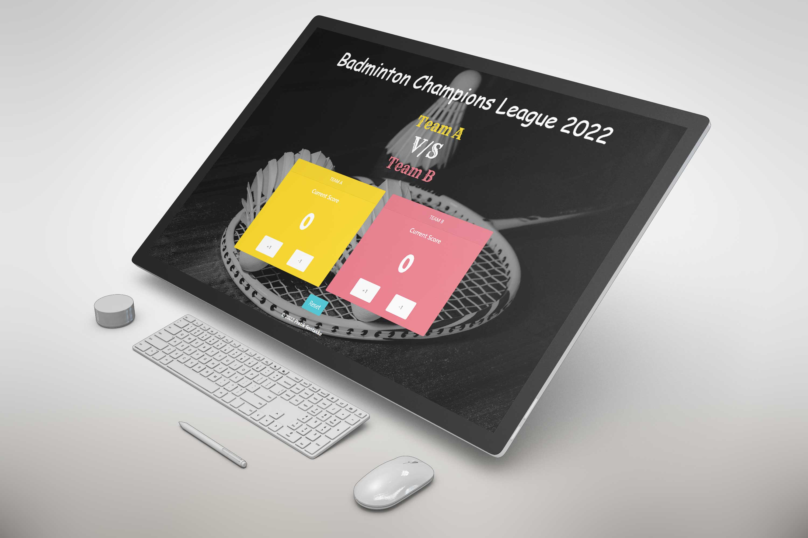

# Badminton Champions League  

Just for learning and get command over the JavaScript, HTML and CSS.

## Deployed link of project
- <a href="https://stirring-gaufre-2d7cb5.netlify.app/">badminton.com </a>

## Team Members

<ul>
  <li><a href="https://github.com/pratiksontakke">Pratik Sontakke</a> (solo project)</li>
</ul>


## Deployment

On frontend terminal perform:

```bash
  Open index.html with live server
```


## 🛠 Tech Stack

- Javascript
- HTML
- CSS

## Functionality

- Responsive for all devices

## Website flow for User

- Landing Page.

#### Website Presentation :





## Thank you note
Thank you all who is giving precious time to visit our little creative project which is made with lot of efforts.

_<p align="center"><sub>- Designed by <a href="https://github.com/pratiksontakke">Pratik Sontakke</a> -</sub></p>_